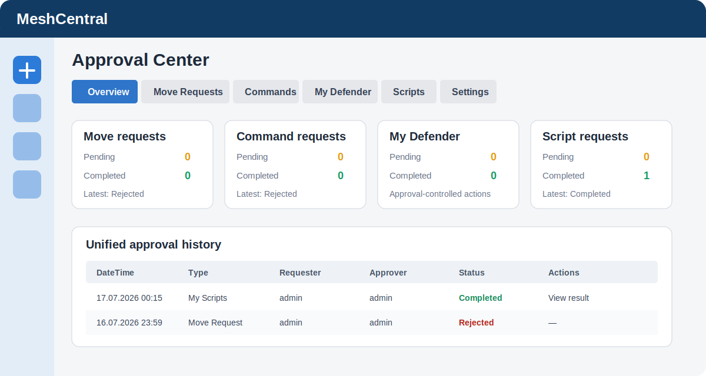

# MeshCentral Approval Center

Approval Center jest wspólnym panelem akceptacji dla pluginów MeshCentral. Jako jedyny zarządza menu, zakładką `Overview`, ustawieniami grup akceptujących oraz bazą `data/requests.db`. Pluginy takie jak MoveRequest, My Commands i MyScripts rejestrują się jako providery i nie zapisują własnych kopii historii.



Aktualnie obsługiwane providery to `Move Request`, `My Commands` i `My Scripts`. Funkcje informacyjne Defender są częścią katalogu My Scripts. Zakładki providerów są wykrywane dynamicznie, również po doinstalowaniu pluginu bez F5. W `Settings` można niezależnie ukryć zakładkę providera oraz jego kartę w `Overview`; dane i API pozostają zachowane.

`Overview` pokazuje oczekujące wnioski i pozwala otworzyć `Approve` lub `Reject` bez przechodzenia do osobnej zakładki providera.

## Instalacja

W MeshCentral otwórz `My Server → Plugins → Download Plugin` i podaj:

```text
https://raw.githubusercontent.com/Eris92/MeshCentral-ApprovalCenter/main/config.json
```

Po instalacji uruchom ponownie MeshCentral lub przeładuj plugin. Następnie otwórz `Approval Center → Settings` i przypisz dla każdego providera osobne grupy poziomów 1, 2 i 3. Bez wybranej grupy dany poziom może zatwierdzić wyłącznie Site Admin.

Provider przekazuje listę wymaganych poziomów wraz z wnioskiem. Approval Center realizuje je kolejno i uruchamia operację dopiero po ostatniej akceptacji. Zwykły użytkownik nie może zatwierdzić ani odrzucić własnego wniosku, nawet jeśli należy do właściwej grupy. Site Admin jest wyjątkiem awaryjnym i może podjąć decyzję na każdym poziomie, również dla własnego wniosku.

## API dla integracji zewnętrznych

W `Approval Center → Settings → External API` utwórz token przypisany do istniejącego konta MeshCentral. Token jest widoczny tylko raz; w `settings.json` zapisywany jest wyłącznie SHA-256. Konto nadal musi mieć prawa requestera lub approvera, a token można ograniczyć do wybranych providerów i scopes: `providers:read`, `requests:read`, `requests:submit`, `requests:decide`.

Bazowy endpoint:

```text
https://mesh.example/approvalcenter/api/v1
```

Najważniejsze operacje:

```text
GET  /providers
GET  /providers/{type}/resources
GET  /requests
GET  /requests/{id}
POST /requests
POST /requests/{id}/decision
```

Każdy `POST` wymaga `Authorization: Bearer ...`, `Content-Type: application/json` oraz unikalnego nagłówka `Idempotency-Key`. Ponowienie tego samego wywołania z tym samym kluczem zwraca istniejący wynik i nie uruchamia operacji drugi raz. Przykłady znajdują się w `examples/Get-ApprovalRequests.ps1` i `examples/Set-ApprovalDecision.ps1`. API jest przeznaczone do połączeń serwer-serwer i celowo nie włącza globalnego CORS.

## Bezpieczeństwo wykonania

- aktywny wniosek może mieć tylko jeden unikalny `activeKey`,
- decyzja aktualizuje wyłącznie rekord nadal mający status `pending` i właściwy bieżący poziom,
- historia przechowuje approvera, notatkę i czas decyzji każdego poziomu,
- self-approval jest blokowane dla wszystkich użytkowników poza Site Admin,
- wykonanie przejmuje rekord warunkowo i zapisuje unikalny `executionId`,
- wynik może zakończyć tylko proces posiadający ten sam `executionId`,
- operacje przerwane restartem są oznaczane jako `failed` i nie są automatycznie ponawiane.

NeDB zapewnia atomowość pojedynczej aktualizacji. Plugin nie zakłada obsługi transakcji obejmującej wiele rekordów.

## Testy

```powershell
npm test
```

Testy obejmują atomowe decyzje, blokadę podwójnego wykonania, idempotencję API, hashowanie i unieważnianie tokenów, zastępowanie aktywnego wniosku oraz rejestrację providerów niezależną od kolejności ładowania.

## Dane i prywatność

Baza oraz ustawienia znajdują się wyłącznie w katalogu pluginu:

```text
plugins/approvalcenter/data/requests.db
plugins/approvalcenter/data/settings.json
```

Nie zapisuj sekretów w payloadach providerów. Provider powinien przechowywać poświadczenia we własnym, szyfrowanym magazynie i przekazywać do Approval Center tylko dane potrzebne do audytu oraz wykonania zatwierdzonej operacji.
