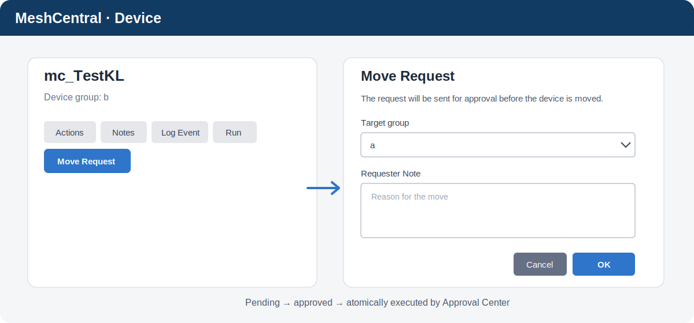

# MeshCentral Move Request

Lekki provider dla `ApprovalCenter`, który dodaje akcję `Move Request` do karty urządzenia MeshCentral. Wtyczka nie tworzy własnego menu ani własnej bazy wniosków.



## Instalacja

Najpierw zainstaluj `ApprovalCenter` przez panel pluginów, używając adresu:

```text
https://raw.githubusercontent.com/Eris92/MeshCentral-ApprovalCenter/main/config.json
```

Następnie zainstaluj Move Request:

```text
https://raw.githubusercontent.com/Eris92/MeshCentral-MoveRequests/main/config.json
```

Po restarcie otwórz kartę urządzenia. Przycisk `Move Request` pojawi się obok natywnych akcji hosta. Grupę zatwierdzającą skonfiguruj w `Approval Center → Settings → Move Request approvers`.

## Zasady działania

- każdy zalogowany użytkownik mający dostęp do urządzenia może wysłać wniosek;
- dostępne są wyłącznie widoczne dla niego grupy tego samego typu i domeny;
- nowy pending request dla tego samego urządzenia zastępuje poprzedni;
- zatwierdzenie jest atomowe, a przeniesienie wykona się najwyżej raz;
- przed wykonaniem ponownie sprawdzane są prawa approvera oraz bieżąca grupa urządzenia;
- decyzje, wykonanie i kliknięcia trafiają do logów MeshCentral;
- Classic i Modern korzystają z natywnych dialogów MeshCentral.

Starszy plik `data/requests.json` może pozostać lokalnie po aktualizacji, ale wersje 2.x nie zapisują do niego nowych danych. Wspólny stan znajduje się w `ApprovalCenter/data/requests.db`.

Wymagana wersja MeshCentral: `>=1.1.18`.

## API

Move Request korzysta ze wspólnego Approval Center API. `GET /approvalcenter/api/v1/providers/moverequest/resources?nodeId=...` zwraca grupy widoczne dla użytkownika przypisanego do tokenu. Wniosek składa się przez `POST /approvalcenter/api/v1/requests` z `type: "moverequest"` oraz payloadem `nodeId` i `targetMeshId`. Gotowy przykład: `examples/Submit-MoveRequest.ps1`.

## Testy

```powershell
npm test
```

Lokalnie potwierdzono przycisk i natywny dialog w interfejsach Classic oraz Modern, zastępowanie wcześniejszego `pending` i wykonanie przeniesienia tylko po decyzji Approval Center.
