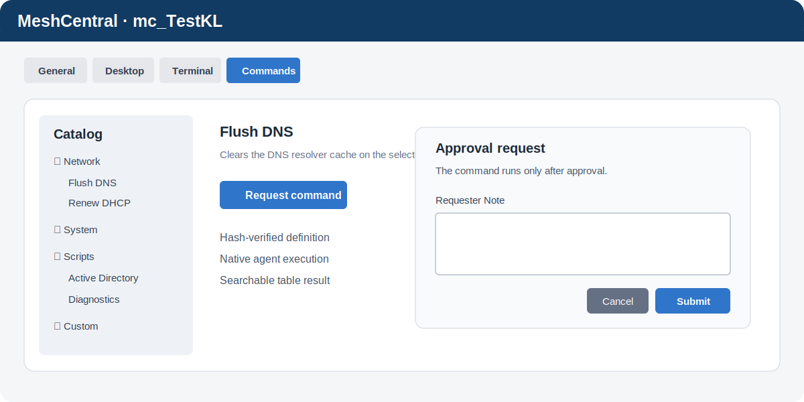

# My Commands

Plugin udostępnia natywną kartę `Commands` na stronie urządzenia MeshCentral. Użytkownik wybiera command lub script, uzupełnia variables i wysyła request. Polecenie trafia do agenta dopiero po zatwierdzeniu w `ApprovalCenter`.



## Instalacja

Najpierw zainstaluj wspólny moduł akceptacji:

```text
https://raw.githubusercontent.com/Eris92/MeshCentral-ApprovalCenter/main/config.json
```

Następnie w MeshCentral Plugin Manager użyj:

```text
https://raw.githubusercontent.com/Eris92/MeshCentral-MyCommands/main/config.json
```

Grupy poziomów zatwierdzania ustaw w `Approval Center → Settings → My Commands approvers`. Skrypty urządzenia obsługują `# Approval_1: true`, `# Approval_2: true` i `# Approval_3: true`; starsze `# Approval: true` oznacza poziom 1. Presety commandów domyślnie wymagają poziomu 1. W `My Commands → Settings` konfigurujesz requester permissions oraz obecność w głównym menu i na karcie urządzenia.

## Skrypty i variables

Skrypty `.ps1`, `.cmd` i `.bat` umieszczaj w `scripts`. Podkatalogi tworzą drzewo. Obsługiwane komentarze nagłówka:

```powershell
# Opis skryptu.
#runAsUser: 0
#Variable: $name, Name
#VariableRequired: $surname, Surname
#VariableSwitch: $registerDns, true, Register in DNS
```

- `runAsUser: 0` — agent;
- `runAsUser: 1` — zalogowany użytkownik;
- `runAsUser: 2` — interaktywny GUI;
- `VariableRequired` wymaga wartości;
- `VariableSwitch` tworzy wybór `Yes/No`.

Skrypty nie korzystają z przechowywanych credentials pluginu. `runAsUser` wybiera kontekst agenta: `0` system/agent, `1` zalogowany użytkownik, `2` interaktywny GUI.

## Postęp i tabele

```powershell
Write-Output "__COMMANDTABS_PROGRESS__ 50% Halfway there"
$json = $rows | ConvertTo-Json -Compress -Depth 4
$base64 = [Convert]::ToBase64String([Text.Encoding]::UTF8.GetBytes($json))
Write-Output ("__MYCOMMANDS_TABLE_B64__" + $base64)
```

Tabela wyniku jest dostępna w `Approval Center → Commands` i obsługuje wyszukiwanie oraz paginację `20/50/100`. Przykład `scripts/Active Directory/Get-AdUsers-Table.ps1` pobiera domyślnie 100 użytkowników AD.

Przed wykonaniem plugin ponownie sprawdza requester, prawa do hosta i hash skryptu/command definition. Atomowy claim w `ApprovalCenter` zapobiega podwójnemu uruchomieniu.

## API

Katalog presetów pobierzesz z `GET /approvalcenter/api/v1/providers/mycommands/resources`; dla drzewa skryptów użyj `?kind=scripts`, a dla pojedynczego skryptu `?scriptPath=...`. Odpowiedź zawiera variables, ale nie publikuje treści poleceń. Request wysyłany do wspólnego `POST /requests` używa `type: "mycommands"`, `nodeid`, `pluginaction` i odpowiednio `commandId`, `scriptPath` lub `cmds`. Przykład: `examples/Submit-TestCommandRequest.ps1`.

## Testy

```powershell
npm test
```

Testy potwierdzają brak wykonania przed akceptacją, weryfikację hash oraz pojedyncze przejęcie zatwierdzonego zadania.
