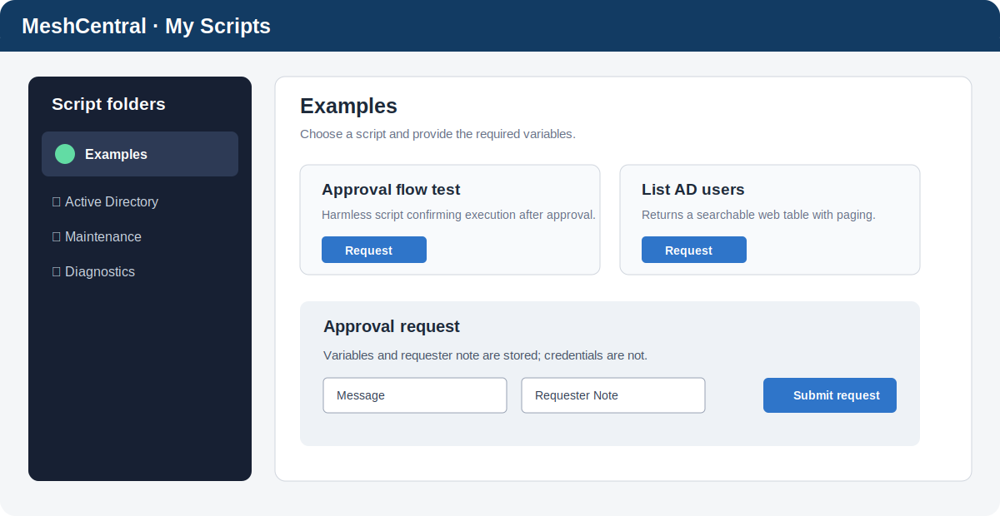

# MeshCentral My Scripts

My Scripts prezentuje skrypty serwerowe w katalogach. Akceptacja jest wymagana wyłącznie po dodaniu co najmniej jednej dyrektywy `# Approval_1: true`, `# Approval_2: true` lub `# Approval_3: true`. Poziomy są wykonywane kolejno. Historyczne `# Approval: true` pozostaje aliasem poziomu 1. Przyciski z ikoną `⏳` wymagają akceptacji, a podpowiedź ikony pokazuje wymagane poziomy.

Pole wyszukiwania w zakładce `Scripts` filtruje cały katalog po nazwie pliku, nazwie wyświetlanej z pierwszego komentarza oraz opisie zapisanym po separatorze `|`. Wyszukiwanie ignoruje wielkość liter i polskie znaki, a pasujące zagnieżdżone katalogi rozwija automatycznie.

## Microsoft Defender

Katalog `scripts/Defender` integruje funkcje informacyjne My Defender z My Scripts. Pozycje `Advanced Hunting`, `Email Explorer` i `Tenant Allow/Block List` wyświetlają natywne karty z bezpiecznymi linkami do portalu Microsoft Defender. `Incidents` pobiera do 50 najnowszych incydentów przez Microsoft Graph i renderuje je jako tabelę z linkami do szczegółów.

Integracja korzysta z **Entra credentials** zapisanych w ustawieniach My Scripts. Aplikacja Entra wymaga co najmniej uprawnienia aplikacyjnego `SecurityIncident.Read.All` z udzieloną zgodą administratora. Sekret nie jest zwracany do przeglądarki ani zapisywany w wyniku skryptu.



## Instalacja

Najpierw zainstaluj Approval Center:

```text
https://raw.githubusercontent.com/Eris92/MeshCentral-ApprovalCenter/main/install-config.json
```

Następnie w `My Server → Plugins → Download Plugin` podaj:

```text
https://raw.githubusercontent.com/Eris92/MeshCentral-MyScripts/main/install-config.json
```

Po instalacji ustaw grupę użytkowników w `My Scripts → Settings`, a grupy poziomów akceptacji w `Approval Center → Settings → My Scripts approvers`.

## Struktura skryptów

```text
scripts/
└── Active Directory/
    ├── Active Directory.svg
    └── Disable-Print.ps1
```

Plik grafiki musi znajdować się wewnątrz katalogu i mieć tę samą nazwę co katalog. Obsługiwane są `.svg`, `.png`, `.jpg`, `.jpeg` i `.webp`.

Pierwszy komentarz opisuje przycisk i podpowiedź:

```powershell
# Zablokuj drukowanie | Ten skrypt zatrzymuje usługę Print Spooler.
# VariableRequired: $computerName, Computer name
```

Obsługiwane zmienne: `Variable`, `VariableRequired`, `VariableSwitch`, `VariableSwitchRequired`, `VariableSelect`, `VariableSelectRequired`, `VariableUser` i `VariableAsset`.

## Kreator użytkownik → urządzenia Jira

Połączenie `VariableUser` i `VariableAsset` uruchamia dwuetapowy kreator. Pierwsza zmienna `VariableUser` korzysta z listy Jira odczytywanej z `settings/users_list.json`. Kolejne zmienne `VariableUser`, np. `Osoba z IT`, korzystają z listy użytkowników MeshCentral i domyślnie wskazują aktualnie zalogowanego użytkownika. Po wybraniu użytkownika Jira przycisk `Next` pobiera urządzenia przypisane do tej osoby. Wybrane urządzenia są przekazywane do skryptu jako wartość zmiennej `VariableAsset`.

```powershell
# Protokół | Generuje protokół dla sprzętu przypisanego w Jira.
# VariableUserRequired: $JiraUser,Użytkownik z Jira
# VariableAssetRequired: $PcName,Sprzęt przypisany do użytkownika
```

Kreator korzysta z `Jira credentials` zapisanych w `My Scripts → Settings`; stare pliki XML DirectoryTools nie są wymagane. Obsługiwane są zwykłe Atlassian API tokens oraz API tokens with scopes. Dla tokenów ze scopes plugin automatycznie używa adresu `https://api.atlassian.com/ex/jira/{cloudId}`; token musi zawierać scopes wymagane przez Jira Service Management Assets, a konto musi mieć dostęp do Assets.

## Bezpieczeństwo

- ścieżka skryptu jest walidowana względem `scripts/`,
- wartości zmiennych nie są składane w polecenie powłoki,
- SHA-256 skryptu jest zapisywany we wniosku i ponownie sprawdzany przed wykonaniem,
- skrypty serwerowe są wykonywane kolejno, z limitem czasu,
- skrypty działają w kontekście procesu MeshCentral; opcjonalne poświadczenia AD, Entra i Jira są przechowywane lokalnie z ochroną Windows DPAPI,
- skrypty AD otrzymują domenę, login i hasło przez `MYSCRIPTS_AD_DOMAIN`, `MYSCRIPTS_AD_LOGIN` i `MYSCRIPTS_AD_PASSWORD`,
- każde kliknięcie, złożenie wniosku, decyzja i wykonanie trafia do eventów MeshCentral.

Metadane `#SaveSecret` ze starego DirectoryTools są wykrywane, ale skrypt pozostaje zablokowany do czasu jawnej migracji sekretów do nowego magazynu per-script. Sekrety nie są kopiowane ze starego pluginu.

## API

`GET /approvalcenter/api/v1/providers/myscripts/resources` zwraca drzewo skryptów wraz z wymaganymi variables. Parametr `scriptPath` ogranicza odpowiedź do jednego skryptu. Wniosek wysyła się przez wspólne `POST /requests` z `type: "myscripts"` i payloadem:

```json
{
  "scriptPath": "Examples/Approval flow test.ps1",
  "variableValues": { "Message": "API test", "IncludeEnvironment": true }
}
```

Przykład `examples/Submit-TestScriptRequest.ps1` jest nieszkodliwy i jedynie potwierdza wykonanie po akceptacji.

## Testy

```powershell
npm test
```

Bezpieczny skrypt przykładowy został lokalnie przeprowadzony przez pełny przepływ `pending → approved → executing → completed`; wynik, requester, approver i obie notatki zapisano w Approval Center.
